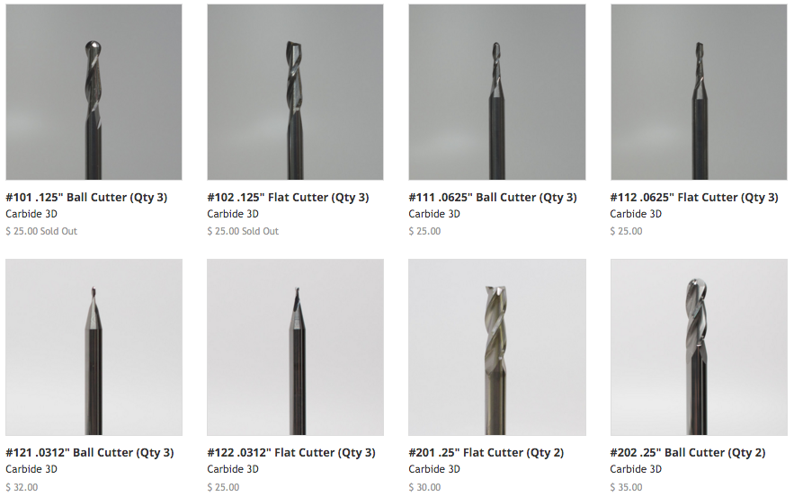
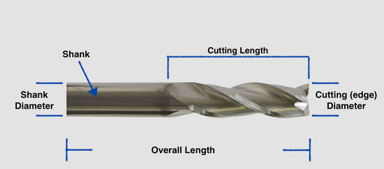

== [underline]#**More Information**#  
If you want to learn more about Speeds and Feeds and Endmills, read the rest of this article.   

If you've done even a moderate amount of looking around for a CNC machine, you're bound to have run across topics discussing both 'speeds and feeds' and which types of endmills are best in certain situations.    

For a beginner, this information seems foreign, daunting, and downright impossible to understand. Don't worry, here's a no frills approach to speeds and feeds and End mills.   

== [underline]#**Speeds and Feeds:**#  

Let's talk about what speeds and feeds actual means, and why they are not as scary as they sound.   

**Speed:** How quickly your spindle is turning the bit. This is literally the RPM of your spindle. 

**Feed:** This is how quickly your machine is moving while cutting the material. Generally in a lateral movement such as across the X or Y axis. Feeds are commonly measured in inches per minute or millimeters per minute.   

.Side note
[NOTE]
====
plunging is sometimes brought up in speeds and feeds. Plunging means how *fast* your machine is pushing the bit DOWN into the material. Think of plunging as the feed rate for your z-axis. Plunging is usually referred to in both depth and speed. example: 'my machine is plunging at 5 inches per minute to a depth of 1/4".' 
====

Speeds and feeds get brought up a lot because if you want to nerd out about the perfect way to cut a material, there is a formula to do so. The formula is based on the number of flutes your bit has, which direction you are cutting, and something called chip-load.    

At Carbide3D we built speeds and feeds into the software that comes with our machines. You need to tell us what material you want to make with, and what diameter bit you'll be using. From there, our software auto calculates the best speed and feed for your job. 
  

  
== [underline]#**End Mills**#  

CNC machines use an end mill to remove material from your stock by spinning the end mill (anywhere from low 1000s RPM to 30,000RPM!). End mills come in all shapes, sizes, and material, but odds are you'll only use a few different types for the projects you make.   

End mills are commonly referred to as 'bits' or 'cutters'   

Here are some of the different end mills we sell for our CNC machines.   

== **[underline]#Parts of an Endmill#**

**verall length:** Measuring your End Mill from one end to the other will yield the overall length of the bit.  

.__Pro Tip__
[TIP]
====
 The longer your bit, the more deflection it will have compared to a shorter bit. You may need to slow your machine down, or generally be less aggressive with your machining if using a longer bit.
====

**Shank Diameter:** This is the diameter of the end of the endmill that will go into your spindle. You'll need to know about your spindle's workholding capacity before selecting the Shank diameter. Common shank sizes are 1/8" (3mm) and 1/4" (6mm). You need to match the shank diameter with your collet size.  

**Cutting Edge Diameter:** This is the diameter of the cutting end of your end mill - the opposite end as the shank. In this image, the shank diameter and the cutting diameter are the same size (1/4"). It's very common to find 1/4" shank end mills with a different (generally smaller) cutting edge diameter.  

**Cutting Length:** The end mill will have flutes that only cover a portion of the overall length of the bit. The cutting legth determines how deep of a pass can be taken with a single plunge.

